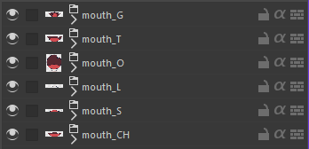
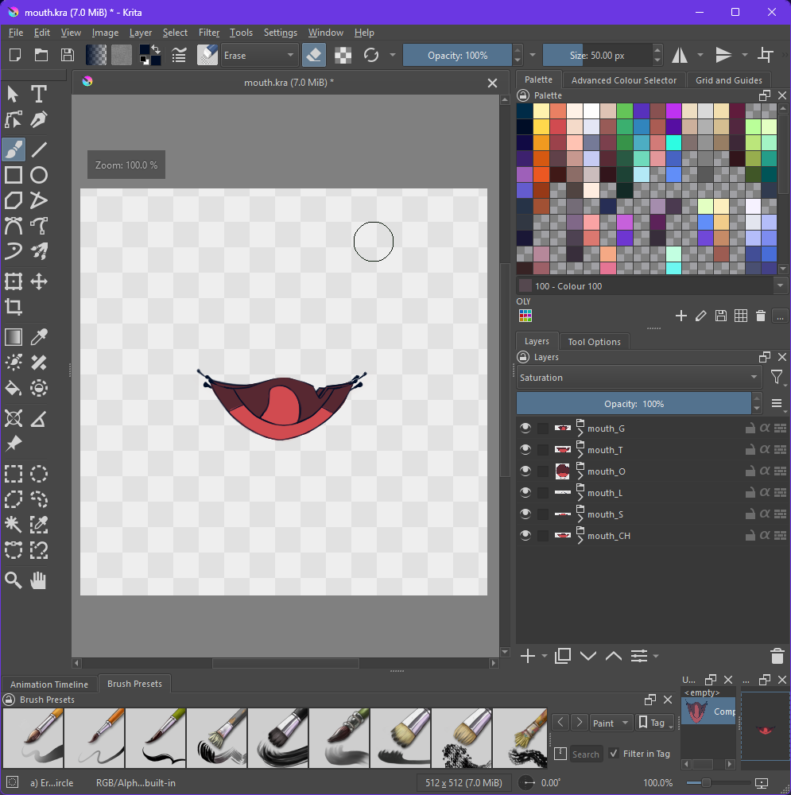
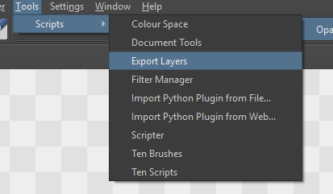
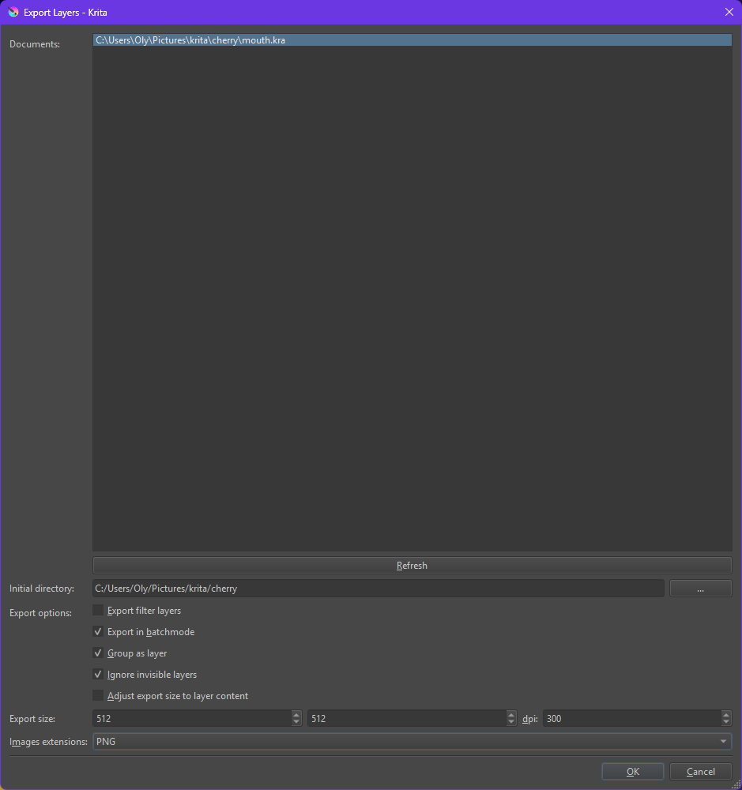
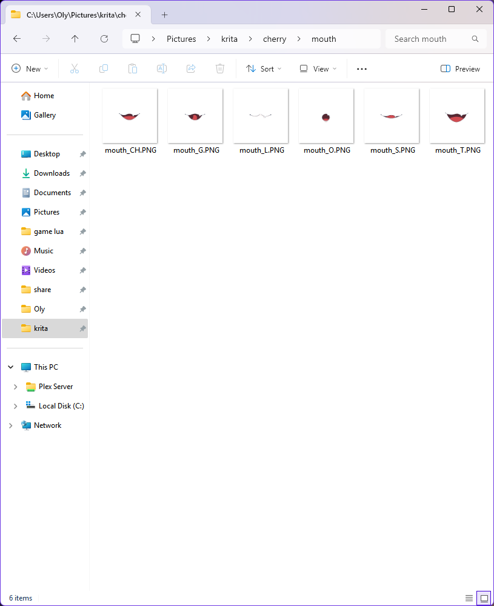
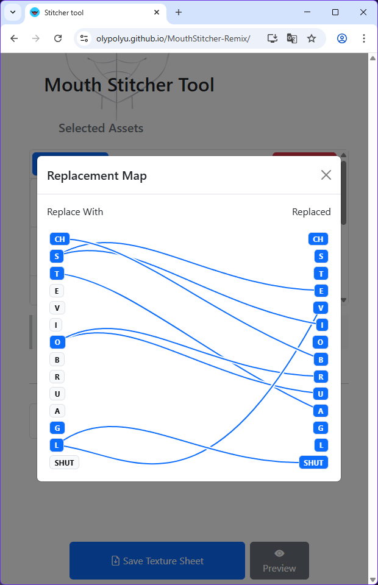
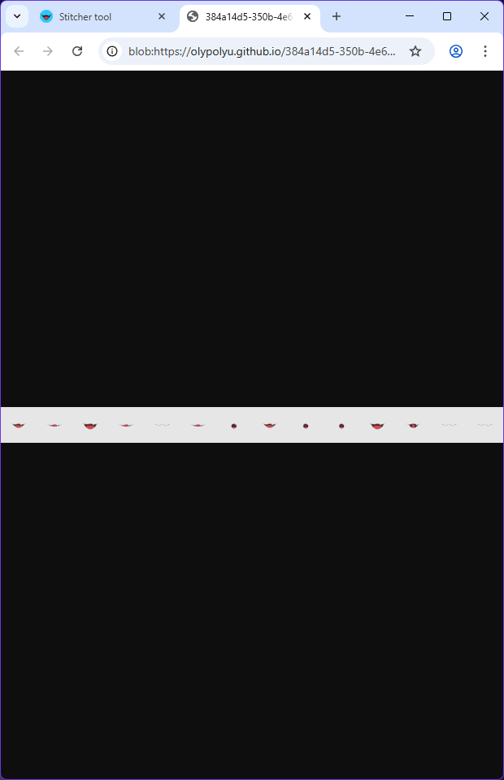

# How to Use

(I will be using Krita, as that is my software of choice. Feel free to contribute instructions for other software.)

## 1. Create a Krita File

Create a new Krita file. It should be a square file with known dimensions, such as 512px by 512px.

## 2. Draw

Draw your mouths within a folder named using the following scheme: `(file name)_(phoneme)`.

It doesn't matter what you do in each folder, but make sure the mouths are centered. You can find references online for the mouths. With all layers enabled, it will look something like this:

## 3. Export Files

Go to `Tools > Scripts > Export Layers`.

Select your document (in my case: `...\mouth.kra`). Then mark the following options:
- Export in batch mode
- Group as layers
- Ignore invisible layers

Alternatively, you can use the shortcut: <kbd>Alt</kbd> + <kbd>G</kbd> + <kbd>I</kbd> + <kbd>M</kbd> + <kbd>P</kbd>.

> _I swear to God I didn't realize it read GIMP until I made this article. LMFAOOO._

Make sure to select:

Then select a directory to save your files, and click `Ok` or use the shortcut <kbd>Alt</kbd> + <kbd>O</kbd> + <kbd>Enter</kbd>.

Your exported layers should look something like this:

## 4. Create the Final Sheet

Simply drag in your files. Enter the texture height, and you're good to go.

As you can see, all phonemes are blue, indicating they are filled directly or via replacement phonemes. Please refer to the graph for explanations.

Previewing the file should give you the correct output.

## Done!

You should be ready to go. Please reference the Official PNGTuber Remix documentation for guidance on what to do next.
